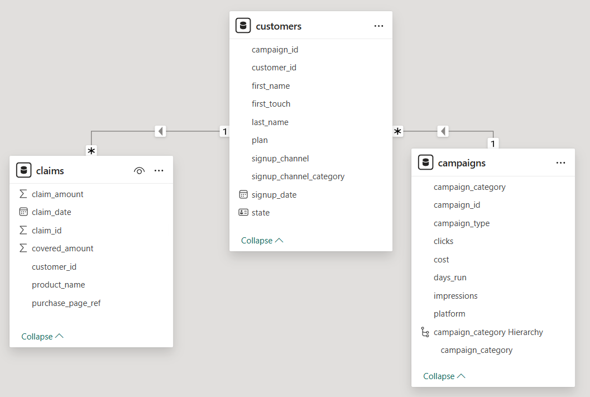
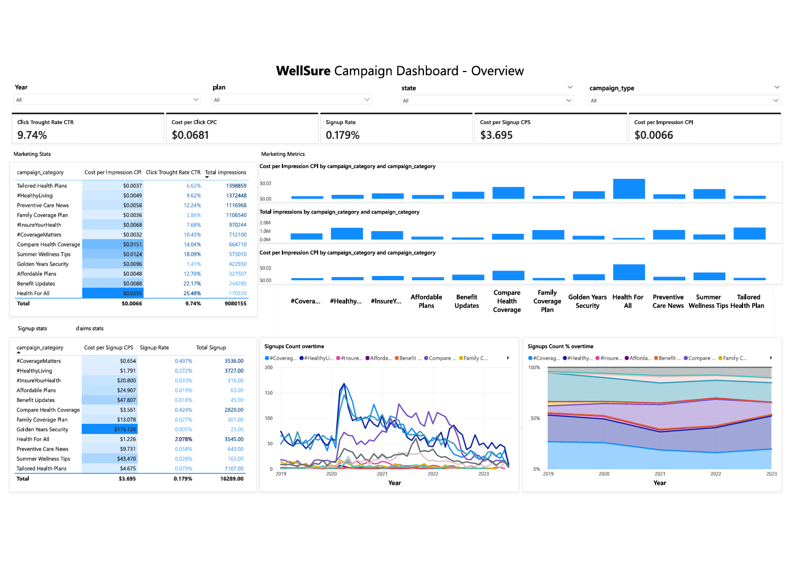

# 📊 WellSure Marketing Campaign Analysis - Project Overview
**A Data Analytics Project to Evaluate Campaign Effectiveness and Support Budget Planning**

---

## 🩺 About the Project

This project presents an end-to-end analysis of marketing campaign performance for **WellSure**, a U.S.-based medical insurance provider serving thousands of customers nationwide. In 2019, WellSure introduced a new set of marketing campaign categories focused on wellness education, plan affordability, and preventative care.

As the company prepares its 2024 marketing strategy, it seeks a deeper understanding of which campaigns are driving customer acquisition and improving brand engagement. This project support budget reallocation decisions.

---

## 🎯 Project Objectives

- Evaluate campaign performance using key marketing and acquisition metrics  
- Identify high- and low-performing campaign categories and platforms  
- Provide data-driven recommendations to improve return on marketing investment

---

## 🧮 Dataset Overview

> ⚠️ *Due to confidentiality restrictions, the original dataset cannot be shared publicly. However, the structure and methodology are detailed below.*

The dataset consisted of three structured tables:

- **Campaigns**: campaign category, platform, impressions, clicks, and cost  
- **Signups**: number of customer signups by campaign and plan type  
- **Claims**: post-signup claim submissions linked to customers and plans  

Date Range: **2019–2023**  
Channels: **Email, SEO, TV, Social Media**

---

## 🧱 Data Model

The following schema was built in Power BI to enable cross-table analysis:

> *Screenshot from Power BI's model view. Tables were joined by campaign ID and customer ID to analyze campaign outcomes from exposure to signup and claim activity.*

---

## 📊 Key Metrics Analyzed

- **Signup Rate** = Signups / Impressions  
- **Cost per Signup (CPS)** = Cost / Signups  
- **Click-Through Rate (CTR)** = Clicks / Impressions  
- **Cost per Impression (CPI)** = Cost / Impressions  

These metrics allowed performance benchmarking across campaign categories and platforms.

---

## 🔍 Summary of Findings

### 🟩 Signup Rate
- *"Health for All"* campaigns had the highest signup rate (2.08%) and the second-highest signup volume (3.5K).  
- *Health Awareness* content performed best overall (2.8% signup rate).  
- *#HealthyLiving* generated the most signups (3.7K) but had a low conversion rate (0.27%).

### 🟦 Click-Through Rate (CTR)
- *Health for All* and *Benefit Updates* achieved CTRs 3–4× above average (25% and 22%).  
- Product promotion campaigns underperformed (0–7%).  
- *Family Coverage Plan* had high impressions but zero clicks, suggesting tracking issues.

### 🟥 Cost per Signup
- *Golden Years Security* had the highest cost per signup ($176) with only 23 signups.  
- Informational and COVID-related campaigns had unusually high customer acquisition costs, reaching over $2K per signup.

---

## ✅ Recommendations

- **Scale up Health for All campaigns**, especially Health Awareness content, due to strong signup and engagement performance.  
- **Reduce budget allocation** to *Golden Years Security*, *#HealthyLiving*, and underperforming COVID campaigns.  
- **Investigate technical or content-related issues** in campaigns with high exposure but no engagement (e.g., *Family Coverage Plan*).  
- **Reallocate spent to Email and Social media platforms**, which demonstrated high efficiency and CTR at lower cost per impression.

---
## 📈 Deliverables

### 📌 Interactive Power BI Dashboard

- Campaign KPIs and filters by type, plan, state, and platform  
- Visual analysis of signup efficiency, cost trends, and engagement  
- Used to support strategic decision-making and stakeholder presentations  

📸 **Dashboard Preview:**  

---

### 📌 Executive Summary Presentation

A presentation was prepared to communicate findings to non-technical stakeholders.

📄 [Click here to view the presentation]()

---

## 🧠 Skills Applied

- Data cleaning (Excel, Power Query)  
- DAX for metric calculation (CPS, CTR, CPI, signup rate)  
- Dashboard development in Power BI  
- Insight communication via presentation slides  
- Stakeholder-focused storytelling

---

## 🚫 Data Access

Due to data privacy and confidentiality agreements, the dataset used in this project is not available for public sharing. For more information or a live walkthrough of the dashboard, feel free to contact me directly.

---

## 🙋 About Me

**Ons Hammemi**  
💼 Junior Data Analyst and  Data Analyst
📫 [My LinkedIn](https://linkedin.com/in/onshammemii)
📂 Portfolio: [My_Git](https://github.com/onshammemii/)

---
